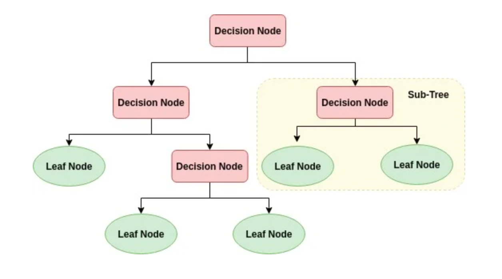

# Decision Tree Classification
Decisions tress (DTs) are the most powerful non-parametric supervised learning method. They can be used for the classification and regression tasks. The main goal of Decision Trees is to create a model predicting target variable value by learning simple decision rules deduced from the data features. Decision trees have two main entities; one is root node, where the data splits, and other is decision nodes or leaves, where we got final output.

## Project Description
This project contains data on the participants' sex, blood pressure, and cholesterol. This information is used to determine which of the five medications would work best for their specific anatomy. This is a classification exercise which uses categorical data and weighted entropy to determine the y-value. Entropy is used to determine purity and the lower the weighted entropy is for a given Decision Node, the more accurate it will be in predicting the dependent variable (y).

